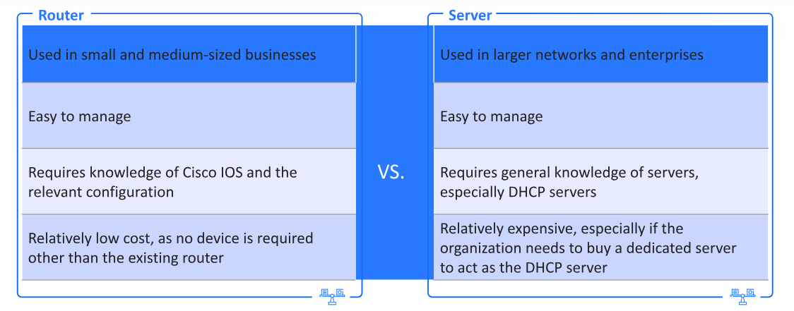

# Infrastructure Services

## Table of Contents
1. DHCP Overview
2. DHCP Implementation
3. NAT overview
4. NAT Implementation

# DHCP Overview

* Why use DHCP?, Its to communicate w/ each other, all devices on a network must have a unique IP address.
* Network administrators will often be responsible for assigning static IP addresses to network components, such as routers, servers, and firewalls, etc.
* Assigning a static IP address for every endpoint in an organization can be time consuming. Many endpoints do not require a static IP address.

## What is DHCP?
* Dynamic Host Configuration Protocol, was designed to manage IP address allocation automatically on any network or device. It operates as a server w/ a range of IP addresses that it allocates dynamically to devices on the network.
* It also includes additional network information, such as the DNS server address, default gateway address, and more. 
* Routers can also operate as DHCP servers.
**DHCP is defined in RFC 2131.**

## DHCP Characteristics
* OSI model layer: DHCP operates in the **application layer** (layer 7) of the OSI and TCP/IP models.
* Logical Ports: DHCP operatoes on UDP ports **67**(server) and **68** (client)
* Versions: DHCP supports both IPv4 (DHCPv4) and IPv6 (DHCPv6)
## DHCP Allocation Methods
* **Dynamic Allocation**: The DHCP server assigns an available IP address to the client from its adress pool for a limited amount of time.
* this means that the client "leases" the address from the server for a period set by the administrator.
* at the end of the lease, the client reqiests an extension or a new address.

* **Automatic Allocation**: As in the dynamic allocation method, the client receives a random available IP address. But in this case, there is no time limit for the address.
* The client does not have to renew the lease for the address it was assigned.

* **Reservation Address**: The network administrator configures the DHCP server to allocate a specific IP address to a selected client device.
* The address is reserved for a specific device in advance based on its MAC address.
* this method is useful for devices such as network printers and others.

## DHCP Operation
* The DHCP process includes four basic steps:
1. Discover, Offer, Request, and Acknowledgement ( DORA )
2. The client device typically starts the process by contacting the server.
3. The information passing between the client and server is encapsulated in dedicated DHCP packets.
4. The DHCP server allocates the IP address and other information according to the chosen allocation method ( dynamic, automatic, etc.)
**The DHCP process is known as DORA**
## DHCP Process

## DHCP Lease Renewal Process
1. DHCP Request: Before a lease expires, the client sends a DHCPREQUEST message directly to the DHCPv4 server that originally offered the IPv4 address.
2. DHCP Acknowledgement: Upon receiving the DHCPREQUEST message, the server verifies it and, if possible, extends the lease information by returning a DHCPACK.
**Messages can be sent in unicast or broadcast**

## Router vs. Server

## DHCPv6
* Unlike, IPv4, IPv6 uses multiple types of addresses from different hosts. DHCPv6 was developed due to the usage in networks of various address formats and prefixes instead of subnet masks.
* DHCPv6 also supports more allocation methods than DHCPv4
* For ex. an IPv6 host can automatically generate an IP address internally using stateless address auto-configuration (SLAAC) or the EUI-64 process for link-local addresses
**DHCPv6 is defeined in RFC 2460**
## DHCPv6 Allocation Methods
* SLAAC: in this method, the device can obtain an IPv6 global address w/o the services of a DHCP server. The device uses ICMPv6 for advertisement messages to provide addressing and other configuration information that would normally be provided by a DHCP server.
* Stateless DHCPv6: Stateless DHCPv6 method informs the client to use the information in the router advertisement (RA) message for addressing, while additional configuration parameters are available from a DHCPv6 server. The client will then communicate w/ a stateless DHCPv6 server to obtain additional information not provided in the RA message, such as a DNS server address.
* Stateful DHCPv6: Like DHCPv4, addressing information and configuration need to be obtained from a DHCPv6 server.

# DHCP Implementation
## Configure a DHCPv4 Server
1. Step 1: Exclude addresses from the DHCP pool, ***run ip dhcp excluded-address*** to reservce an IP address for the default gateway or statically configured servers.
2. Step 2: Setup a DHCP pool of addresses using ***ip dhcp pool***
3. Step 3: Cofngiure a specific tasks, such as the default gateway, DNS server, domain name, etc.
**NOTE**: The lease 0 4 30 ( days, hours, minutes) will not work in packet tracer, but it does work on real cisco devices.

## Verify DHCP Settings
 * Several commands can be used to verify and trouble shoot DHCP settings:

 ***show ip dhcp pool***: displays pool settings
 
 ***show ip dhcp binding***: displays the client list, w/ IP, MAC address, and lease expiration

***show ip dhcp conflict***: Displays IP conflicts detected during DHCP negotiation

## Configuring DHCPv4 Relay

* DHCP relay is a technique that allows devices to obtain addresses from a DHCP server on a remote network.
**Note**: Broadcast messages are not transmitted to other networks. When a client sends a DHCPDISCOVER, the router acts as a relay and forwards the messages direcrtly tro the server in unicast.
* Enable the ***ip helper-address*** command and DHCP server address on the interface that receives the requests.

## Configuring a DHCPv4 Client

* A router can aslo act as a DHCP client, its interface can be set manually or dynamically.
* Use the ***ip address dhcp*** command on the interface to enable dynamic allocation.
* For ex. an interface facing the ISP typically gets an IP from the ISP DHCP server.

# NAT Overview

* **NAT Protocol**: Network address translation(NAT) is essential protocol and service that converts a private address to a public address and vice versa.
* NAT is usually enabled on a firewall or router device at the edge of the local network and the beginning of the outside network.
* Access to the internet from any home-based, corporate, or local network is only possible through NAT.
**NAT is defined in RFC 2663.**

* **NAT's Usefulness**: Although IPv4 is required for a device to communicate properly, the number of available addresses is being depleted rapidly, and, at this rate, a worldwide address shortage is imminent.
* To save addresses and slow the depletion, private addresses were separated from public addresses.
* Private addresses uniquely identify devices within a network, such as a computer connected to an internal server.
* Public addresses identify groups of computers outside of a local network.
* **Private IP addresses are defined in RFC 1918**

## Private IP Space

## NAT Operation
* How NAT works: The NAT process is transparent to users, and any evidence of its operation is stored in a special table in the NAT-enabled device.
* This helps hide the internal network from the internet and adds an extra layer of security.
* NAT operatoes in one of three methods: static, dynamic, or port address translation (PAT)
* Each method uses a specific address terminology to describe its operation.

**Theoretically, the maximum number of private addresses that can be translated into one public address is 65,536**

## NAT pros vs cons

## NAT Address Terminology

1. Inside Local: The source IP of the local device in the private network, ex. 10.0.0.5/24
2. Outside Local: The IP address of the destiniation device as viewed from the inside local device (the destination LAN) for ex. a remote web server.
3. Inside Global: The public IP address used by the inside local device for identification and access to the internet. for ex. the ip address on an interface facing a WAN.
4. Outside Global: The IP address of the destination device as viewed from the outside network ( the NAT-enabled router), for ex. a remote web server.

## NAT Operation Steps

## NAT Methods

1. Static NAT: One to one NAT; this is a permanent mapping of a single private IP to a specific single public address, this method is not meant to conserve IPv4 addresses but to allow access to internal resources from an outside network.
2. Dynamic NAT: Many to many NAT; This method is also not meant to conserve addresses, multiple IP addresses are mapped dynamically by the router to a pool of public addresses, the conversion is done on a first-come, first-served basis.
3. NAT Overload: Many-to-one NAT; NAT overload or port address translation ( PAT) is the most common method and is used to conserve addresses, in this method, multiple private IP addresses are converted into a single public address. To distinguish the traffic from different devices, the source port number is also used for the inside global address.

## NAT64

* Network address translation IPv6 to IPv4(NAT64)technology facilitates communication between IPv6-only and IPv4-only hosts and networks, the solution allows enterprises and ISPs to accelerate IPv6 adoption while simultaneously handling IPv4 address depletion.

# NAT Implementation

## NAT Interface Configuration

the first step in configuring NAT is to set the routers interfaces for the translation process.
* the ip nat inside\outside command tells the router which interfaces will participate in the NAT process and their direction based on the network topology.
* Each interface connected to the private network is defined as inside, and each interface connected to the internet is defined as outside.

## Static NAT Configuration
**command**: ip nat inside source static < local-ip> < global-ip>

* In this example, a user wants to connect to the internal server from somewhere on the internet.
* the user cannot access the LAN directly, so it sends the request to public router interface 209.15.10.1, and the router uses the NAT static map to forward the request otthe 10.0.0.10 server
* The second section in the example on the right is for port forwarding, it forwards only SSH traffic from outside to the server.

## Dynamic NAT Configuration

**Assume the ISP defined 10 public addresses on the WAN interface:**
1. Step 1: create a public address pool using ***ip nat pool***
2. Step 2: Configure standard ACL to identify local addresses that need to be translated using ***access-list***
3. Step 3: Bind the ACL and the pool using ***ip nat inside source list***
**Note**: using this method, the pool should contain enough available addresses: one for each device.
## NAT Overload Configuration

## Verify NAT Settings

